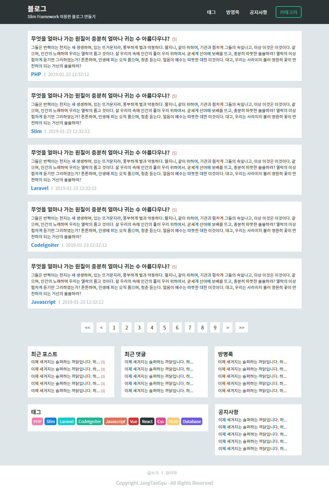

# Slim Framework 이용한 블로그 만들기



## 설치하기

``` bash
# Git Clone
$ git clone https://github.com/JangTaeGyu/slim-blog.git

$ cd slim-blog

# Install
$ composer install

# ./src/settings.php 데이터베이스 계정 설정 후 진행을 해주세요.
$ ./vendor/bin/phinx migrate

# Dev Server Start
$ composer start
```
작업중인 개인 프로젝트입니다.

## 진행사항

- [x] ~~티스토리 벤치마킹~~
- [x] ~~데이터베이스 설계~~
- [x] ~~ERD 구성~~ <https://www.erdcloud.com/d/CK5mZH5Cqd5LHWkk7>
- [x] ~~Slim Framework 설치 및 셋팅~~
- [x] ~~관리자 샘플 개발~~
- [x] ~~관리자 퍼블리싱~~
- [ ] 관리자 퍼블리싱 적용 및 개발(진행중)
- [ ] 사용자 샘플 개발
- [ ] 사용자 퍼블리싱
- [ ] 사용자 퍼블리싱 적용 및 개발
- [ ] 추가 작업(에디터 추가, 태그 추가, 방문자 통계 추가)
- [ ] 최종 테스트
